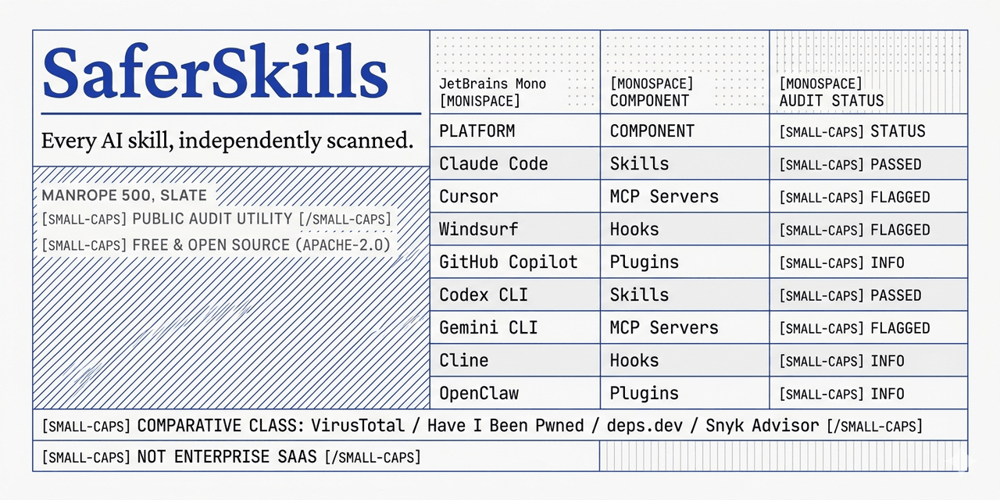

<div align="center">

<picture>
  <source media="(prefers-color-scheme: dark)" srcset="./webapp/public/banner-dark.png">
  <source media="(prefers-color-scheme: light)" srcset="./webapp/public/banner.png">
  
</picture>

# SaferSkills

**Every AI capability, independently scanned.** Search, install, and verify skills, MCP servers, hooks, and plugins across every agent platform. Free. Open source. Apache 2.0.

[](./LICENSE)
[](https://github.com/OpenLatch/saferskills/actions/workflows/pr-checks.yml)
[](https://securityscorecards.dev/viewer/?uri=github.com/OpenLatch/saferskills)
[](#project-status)
[](https://github.com/OpenLatch/saferskills/discussions)

[saferskills.ai](https://saferskills.ai) · [Methodology](./docs/methodology.md) · [Discussions](https://github.com/OpenLatch/saferskills/discussions) · [Security](./SECURITY.md)

</div>

---

## Why

You install a Claude skill, an MCP server, a Cursor rules file, or a Codex hook. It runs with your file-system access. It can read your `.env`. It can `curl | bash`. It can ship your repo to a paste site. There is **no public, transparent record** of what each of those tens of thousands of items actually does.

SaferSkills is that public, transparent record. Anyone — a developer, a vendor, a researcher — can submit a GitHub URL. A 30-second scan returns a digestable security report: aggregate trust score (0–100), four-tier breakdown (Identity / Integrity / Behavior / Provenance), every detector that fired, the rule that fired it, the exact line of evidence, the remediation, and a permalink that vendors can dispute.

Methodology, not opinion. Every rule is documented. Every score is reproducible. Every appeal is public.

## Quick start

The [`saferskills` CLI](./cli/README.md) installs any cataloged Skill or MCP server to your AI agent with the independent trust score **re-checked at install time** — across Claude Code, Cursor, Windsurf, Copilot, Codex, Gemini, Cline & OpenClaw:

```bash
npx saferskills info <name>        # an item's score, findings & report URL
npx saferskills install <name>     # install to your detected agents (severity-gated)
npx saferskills scan ./my-skill    # scan a local capability — or a GitHub URL

# Or browse the catalog at
open https://saferskills.ai
```

The CLI publishes to [npm](https://www.npmjs.com/package/saferskills) + [crates.io](https://crates.io/crates/saferskills). Full command + flag reference: [`cli/README.md`](./cli/README.md).

> v0.x — building publicly through 2026-08, ahead of the headline launch. The catalog at [saferskills.ai](https://saferskills.ai) is filling in. See [Project status](#project-status).

## How it works

```
┌───────────────────┐    ┌──────────────────────┐    ┌───────────────────┐
│ Public catalog    │    │ Scan engine          │    │ Public scan report│
│ (GitHub URL in)   │───▶│ • Identity / sig     │───▶│ 0–100 score       │
│                   │    │ • Integrity / fuzz   │    │ 4-tier breakdown  │
│ ~30k items at GA  │    │ • Behavior / pattern │    │ Every rule + line │
│                   │    │ • Provenance / chain │    │ Vendor right-of-  │
│                   │    │                      │    │ reply on every    │
│                   │    │                      │    │ deny verdict      │
└───────────────────┘    └──────────────────────┘    └───────────────────┘
```

## Trust score rubric

| Tier | Range | Meaning |
|---|---|---|
| Green | 80–100 | Indexed, signed, behaviorally clean, provenance-verified |
| Yellow | 60–79 | Known author, no critical findings, some lower-severity flags |
| Orange | 40–59 | Anonymous author OR mid-severity finding OR provenance unclear |
| Red | 0–39 | Critical finding (prompt injection / shell RCE / secret exfil / supply-chain) |

Sub-scores are weighted (Identity 25% · Integrity 25% · Behavior 30% · Provenance 20%). Full rubric: [docs/methodology.md](./docs/methodology.md). Every detection rule: [docs/rules.md](./docs/rules.md).

## Use it as

| Mode | Audience | Status |
|---|---|---|
| **Service** — browse [`saferskills.ai`](https://saferskills.ai), share a permalink | every dev, every researcher | live — catalog + scan reports |
| **CLI** — `npx saferskills install <name>` | individual installers | shipped — [npm](https://www.npmjs.com/package/saferskills) + crates.io |
| **Self-host** — `docker compose up` (this repo) | privacy-strict orgs, air-gapped builds | scan engine shipped (Track B) |

## Project status

**v0.x — building publicly through 2026-08.** First public release ~2026-08.

Live tracks (see `vault/05-GTM/Launch/SaferSkills - Build Plan.md` if you have vault access, otherwise see [the Initiative summaries](./.local/.brainstorms/foundation/2026-05-25-design.md)):

- ✅ **I-01 — Foundation** (W1) — this repo, CI, brand, legal chassis, codegen, placeholder homepage
- ✅ **I-02 — Scoring engine** (Track B) — deterministic detector rules, explainable findings, public scan reports
- ✅ **I-03 — Catalog ingestion** (Track A) — multi-source ingestion + auto-scan of every indexed capability
- ✅ **I-04 — Web catalog + scan-report** (Track D) — live catalog, item + scan-report surfaces, upload + unlisted scans
- ✅ **I-05 — CLI** (Track C) — `npx saferskills` on npm + crates.io: install across all 8 agents, install-time score re-verification, severity-gated installs, `scan` / `scan --local`
- ⏳ **I-06 — Email + watchlist + B2B intel** (W7-9 / Track E)
- ⏳ **I-07 — Launch headline** (W10)

## Develop

```bash
git clone https://github.com/OpenLatch/saferskills.git
cd saferskills
pnpm install
pnpm run generate     # 6 generators: Pydantic + SQLAlchemy + openapi.json + TS DTO + Zod
docker compose up     # postgres + api + webapp
curl http://localhost:8000/api/v1/health
open http://localhost:5173
```

Requirements: Node 24 LTS, Python 3.14, pnpm 10, uv 0.7+, Docker.

## Contributing

We welcome contributions — code, detection-rule RFCs, scan-report appeals, and translations. Read [CONTRIBUTING.md](./CONTRIBUTING.md), [Code of Conduct](./.github/CODE_OF_CONDUCT.md), and [docs/methodology.md](./docs/methodology.md) first.

Detection-rule proposals go via [the rule-RFC issue template](.github/ISSUE_TEMPLATE/03-rule-proposal.yml). Vendor appeals go via [the vendor-appeal template](.github/ISSUE_TEMPLATE/04-vendor-appeal.yml).

## Security

Vulnerabilities in SaferSkills itself: see [SECURITY.md](./SECURITY.md) (GitHub Private Vulnerability Reporting or `security@openlatch.ai`).

Concerns about **what SaferSkills says about an item it scans** (incorrect verdict, scope dispute, rule misapplication): file a [vendor appeal](.github/ISSUE_TEMPLATE/04-vendor-appeal.yml) or email `appeals@openlatch.ai`. Every appeal gets a substantive public response within 1 hour for verified maintainers.

## License

Apache License 2.0 — see [LICENSE](./LICENSE). Stewarded by [OpenLatch](https://openlatch.ai).
