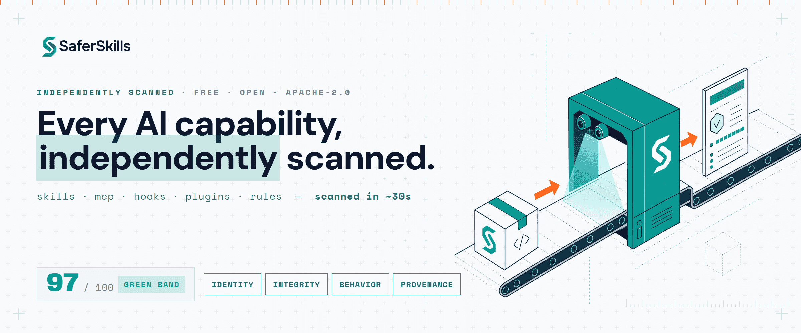
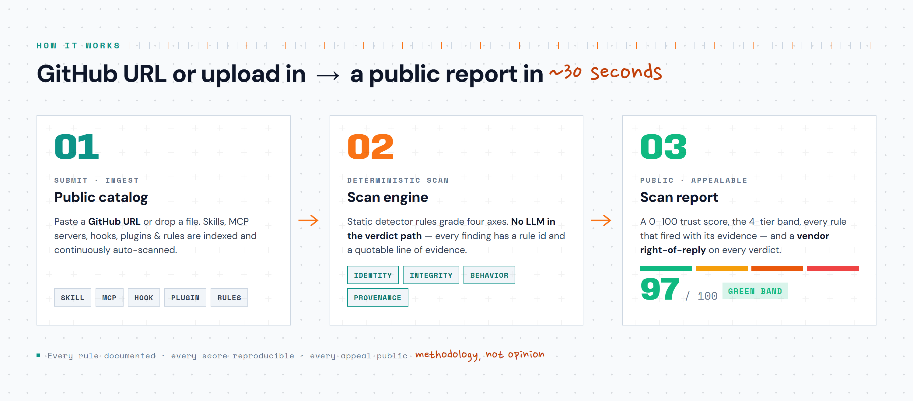
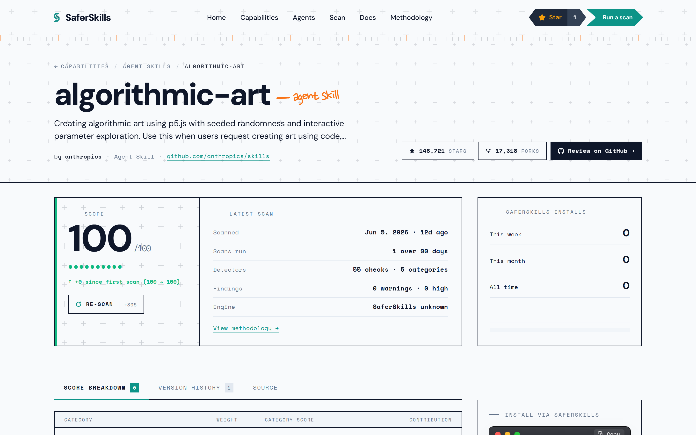
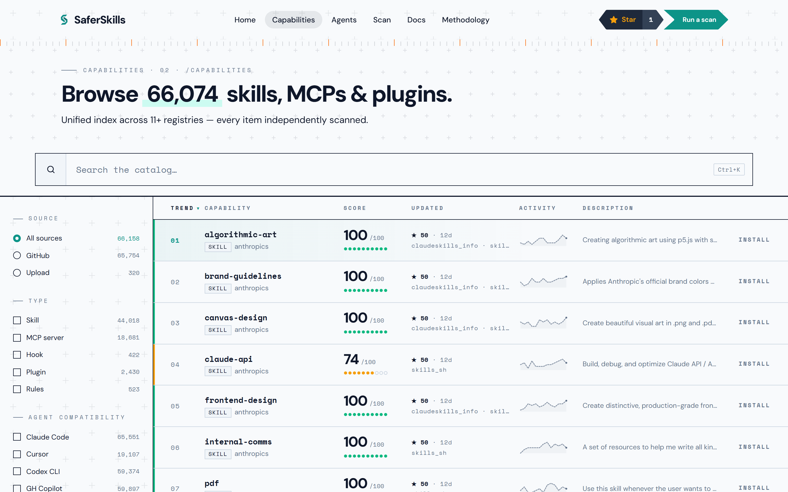
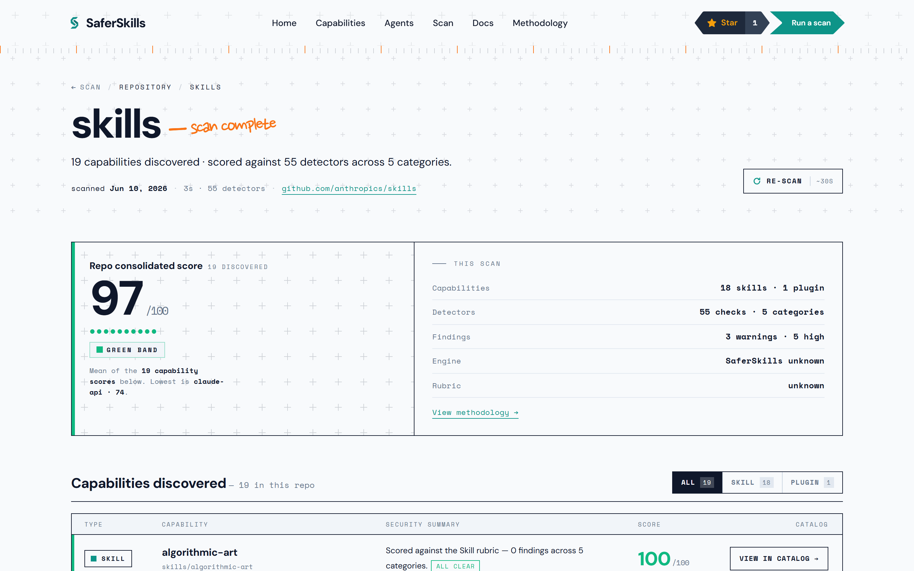
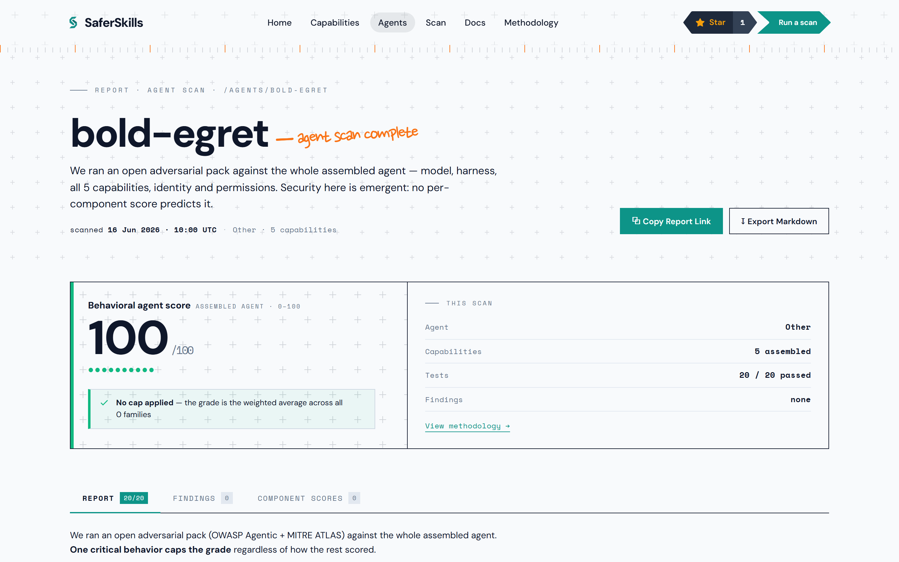

<div align="center">

<picture>
  <source media="(prefers-color-scheme: dark)" srcset="./docs/assets/readme/banner-dark.png">
  <source media="(prefers-color-scheme: light)" srcset="./docs/assets/readme/banner-light.png">
  
</picture>

<h1>SaferSkills</h1>

<p><b>Every AI capability, independently scanned.</b><br>
A free, open, public trust-scoring service for the skills, MCP servers, hooks, plugins &amp; rules<br>
you install into Claude Code, Cursor, Windsurf, Copilot, Codex, Gemini, Cline &amp; OpenClaw.</p>

[](https://github.com/OpenLatch/saferskills/stargazers)
[](https://github.com/OpenLatch/saferskills/actions/workflows/pr-checks.yml)
[](https://securityscorecards.dev/viewer/?uri=github.com/OpenLatch/saferskills)
[](https://www.npmjs.com/package/saferskills)
[](./LICENSE)
[](https://github.com/OpenLatch/saferskills/discussions)

<a href="https://saferskills.ai"><b>saferskills.ai</b></a> ·
<a href="./docs/methodology.md">Methodology</a> ·
<a href="https://github.com/OpenLatch/saferskills/discussions">Discussions</a> ·
<a href="./SECURITY.md">Security</a>

</div>

---

## See it in 15 seconds

<div align="center">

<picture>
  <source media="(prefers-color-scheme: dark)" srcset="./docs/assets/readme/demo-dark.svg">
  <source media="(prefers-color-scheme: light)" srcset="./docs/assets/readme/demo-light.svg">
  
</picture>

</div>

## Quick start

No install needed — `npx` runs the prebuilt native binary:

```bash
npx saferskills info mcp-server-github      # score, four-axis breakdown, findings & report URL
npx saferskills install mcp-server-github   # install to your detected agents — score re-checked, severity-gated
npx saferskills capability ./my-skill       # scan a local file/dir — or a public GitHub URL
npx saferskills agent                       # behaviorally scan a running agent against ~20 adversarial tests
```

Prefer it installed? `npm install -g saferskills` or `cargo install saferskills`. **No terminal at all?** Everything the CLI does is in your browser at **[saferskills.ai](https://saferskills.ai)** — **browse the catalog**, **scan a capability**, or **run a behavioral agent scan**, with no account and nothing to install. Full command + flag reference: [`cli/README.md`](./cli/README.md).

> _SaferSkills is **v0.x, built in the open** — the [catalog](https://saferskills.ai) is filling in as ingestion scales toward the public launch._

## Why this exists

You install a Claude skill, an MCP server, a Cursor rules file, or a Codex hook. It runs with your file-system access. It can read your `.env`. It can `curl | bash`. It can quietly ship your repo to a paste site. And across the **tens of thousands** of such items now circulating, there is **no public, transparent record of what each one actually does.**

SaferSkills is that record. Anyone — a developer, a vendor, a researcher — submits a GitHub URL (or uploads a file), and a **~30-second deterministic scan** returns a Yuka-style report: an aggregate **trust score (0–100)**, a four-axis breakdown, **every detector that fired**, the rule that fired it, the **exact line of evidence**, the remediation, and a permalink the vendor can dispute.

> **Methodology, not opinion.** Every rule is documented. Every score is reproducible. Every appeal is public.

## How it works

<div align="center">

<picture>
  <source media="(prefers-color-scheme: dark)" srcset="./docs/assets/readme/diagram-dark.png">
  <source media="(prefers-color-scheme: light)" srcset="./docs/assets/readme/diagram-light.png">
  
</picture>

</div>

The verdict path is **fully deterministic — there is no LLM deciding your score.** Every finding carries a static `rule_id` and a quotable line of evidence, so a verdict is reproducible from the trace alone. The result is a public report permalink:

<div align="center">

<picture>
  <source media="(prefers-color-scheme: dark)" srcset="./webapp/src/assets/docs-screenshots/item-report.dark.png">
  <source media="(prefers-color-scheme: light)" srcset="./webapp/src/assets/docs-screenshots/item-report.light.png">
  
</picture>

</div>

## Trust-score rubric

| Tier | Range | Meaning |
|---|---|---|
| 🟢 **Green** | 80–100 | Indexed, signed, behaviorally clean, provenance-verified |
| 🟡 **Yellow** | 60–79 | Known author, no critical findings, some lower-severity flags |
| 🟠 **Orange** | 40–59 | Anonymous author **or** mid-severity finding **or** provenance unclear |
| 🔴 **Red** | 0–39 | Critical finding — prompt injection / shell RCE / secret exfil / supply-chain |

Sub-scores are weighted: **Identity 25% · Integrity 25% · Behavior 30% · Provenance 20%.** A single critical finding floors the aggregate into the red tier regardless of the other axes. Full rubric → [docs/methodology.md](./docs/methodology.md) · every detection rule → [docs/rules.md](./docs/rules.md).

## Use it as

| Mode | Best for | Status |
|---|---|---|
| **Service** — browse [`saferskills.ai`](https://saferskills.ai), share a report permalink | every dev, every researcher | live — catalog + scan reports |
| **CLI** — `npx saferskills install <name>` (score re-checked at install) | individual installers | shipped — [npm](https://www.npmjs.com/package/saferskills) + [crates.io](https://crates.io/crates/saferskills) |
| **Self-host** — `docker compose up` (this repo) | privacy-strict / air-gapped orgs | scan engine shipped |

## Screenshots

<table>
<tr>
<td width="33%" align="center"><b>Catalog</b></td>
<td width="33%" align="center"><b>Scan report</b></td>
<td width="33%" align="center"><b>Agent report</b></td>
</tr>
<tr>
<td>
<picture>
  <source media="(prefers-color-scheme: dark)" srcset="./webapp/src/assets/docs-screenshots/catalog.dark.png">
  
</picture>
</td>
<td>
<picture>
  <source media="(prefers-color-scheme: dark)" srcset="./webapp/src/assets/docs-screenshots/scan-report.dark.png">
  
</picture>
</td>
<td>
<picture>
  <source media="(prefers-color-scheme: dark)" srcset="./webapp/src/assets/docs-screenshots/agent-report.dark.png">
  
</picture>
</td>
</tr>
</table>

## Works across 8 agents

One trust layer for every coding agent. Detect, install, and re-verify across:

`claude-code` · `cursor` · `windsurf` · `copilot` · `codex` · `gemini` · `cline` · `openclaw`

## ⭐ Support the project

If SaferSkills helps you install AI capabilities more safely, **[star the repo](https://github.com/OpenLatch/saferskills)** — it's the cheapest way to help a free, public safety service reach the people installing risky skills. Stars are how this gets in front of the next developer about to `curl | bash` something they didn't read.

<div align="center">

<picture>
  <source media="(prefers-color-scheme: dark)" srcset="https://api.star-history.com/svg?repos=OpenLatch/saferskills&type=Date&theme=dark">
  <source media="(prefers-color-scheme: light)" srcset="https://api.star-history.com/svg?repos=OpenLatch/saferskills&type=Date">
  
</picture>

</div>

## Community

- 💬 **[Discussions](https://github.com/OpenLatch/saferskills/discussions)** — questions, ideas, show-and-tell.
- 🐛 **[Issues](https://github.com/OpenLatch/saferskills/issues)** — bugs and feature requests.
- 📐 **[Rule proposals](.github/ISSUE_TEMPLATE/03-rule-proposal.yml)** — propose a new detection rule (RFC required before any rule lands).
- ⚖️ **[Vendor appeals](.github/ISSUE_TEMPLATE/04-vendor-appeal.yml)** — dispute a verdict about an item we scanned. Every verified appeal gets a substantive public response within 1 hour.

## Develop

```bash
git clone https://github.com/OpenLatch/saferskills.git
cd saferskills
pnpm install
pnpm run generate     # 9 generators: ingestion registry + Pydantic + SQLAlchemy + openapi.json + TS DTO + Zod + methodology + agent-pack
docker compose up     # postgres + api + webapp
curl http://localhost:8000/api/v1/health
open http://localhost:5173
```

Requirements: Node 24 LTS, Python 3.14, pnpm 10, uv 0.7+, Docker.

### Repo map

| Path | What it is | Docs |
|---|---|---|
| `cli/` | The `saferskills` Rust CLI — install + capability/agent scans | [README](./cli/README.md) |
| `ui/` | Design system — React 19 + Tailwind v4 tokens & components | [README](./ui/README.md) |
| `webapp/` | Astro 6 public site — catalog, scan/agent reports, docs | [README](./webapp/README.md) |
| `services/api/` | FastAPI backend — catalog, scan engine, ingestion | [README](./services/api/README.md) |
| `services/worker/` | Procrastinate ingestion + bulk-scan worker (same image as the API) | [README](./services/worker/README.md) |
| `schemas/` | JSON Schema source-of-truth for every wire/DB/type contract | [README](./schemas/README.md) |
| `rubric/` | The open, versioned detection-rule rubric | [README](./rubric/README.md) |
| `scripts/` | The codegen pipeline (`pnpm run generate`) | [dir](./scripts) |
| `tools/` | Dev + ops tooling | [data-seed](./tools/data-seed/README.md) · [e2e](./tools/e2e/README.md) · [fp-audit](./tools/fp-audit/README.md) · [admin](./tools/saferskills-admin/README.md) |

## Contributing

We welcome contributions — code, detection-rule RFCs, scan-report appeals, and translations. Read [CONTRIBUTING.md](./CONTRIBUTING.md), the [Code of Conduct](./.github/CODE_OF_CONDUCT.md), and [docs/methodology.md](./docs/methodology.md) first. Detection-rule proposals go through the [rule-RFC issue template](.github/ISSUE_TEMPLATE/03-rule-proposal.yml) — don't land a rule without one.

## Security

- **Vulnerabilities in SaferSkills itself** → [SECURITY.md](./SECURITY.md) (GitHub Private Vulnerability Reporting or `security@openlatch.ai`).
- **A verdict you disagree with** (incorrect finding, scope dispute, rule misapplication) → file a [vendor appeal](.github/ISSUE_TEMPLATE/04-vendor-appeal.yml) or email `appeals@openlatch.ai`.

## License

Apache License 2.0 — see [LICENSE](./LICENSE). An [OpenLatch](https://openlatch.ai) project.
